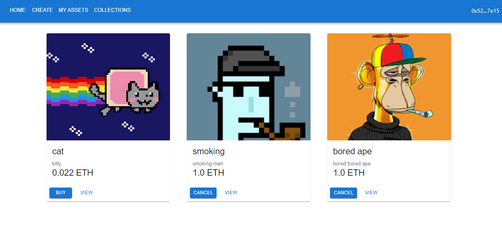

# Basic NFT MarketPlace using Hardhat and next js

in this app you can create NFT collections, mint your own NFTs and sell them on Etherum and other EVM compatible blockchains

[Live Demo](https://nft-marketplace-pi-pied.vercel.app/)

<br/>
<p align="center">

</p>
<br/>
for installing required libraries run

```shell
npm install
```

for starting server run

```shell
npm run dev
```

also create a .env file and place your alchamy endpoints there(you should sign in alchamy and create your own project)

following tasks are for working with hardhat:

```shell
npx hardhat accounts
npx hardhat compile
npx hardhat clean
npx hardhat test
npx hardhat node
node scripts/deploy.js
npx hardhat help
```
